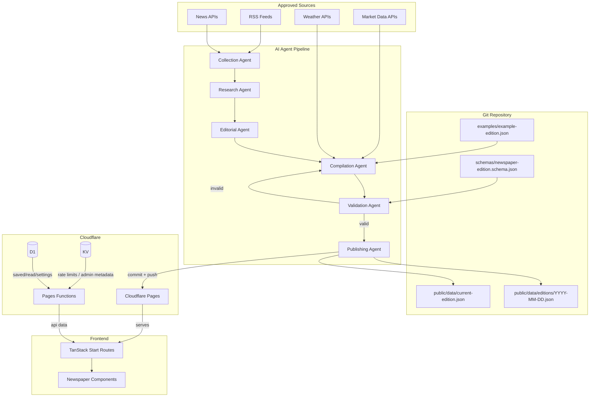

# Phased Build Plan — The Morning Wire

> **Architecture update:** This plan originally proposed a separate Cloudflare
> Cron Worker for edition generation. That approach has been removed.
> Generation and publishing now run on your local machine via
> `scripts/publish-edition.ts`. Cloudflare only hosts the built site.

## 1. Project Objective

**The Morning Wire** is a single-user, newspaper-style web application that publishes one AI-curated edition every morning before the reader wakes up. The frontend already exists as a React 19 + TanStack Start application styled like a broadsheet. This plan defines how a Cloudflare-compatible backend and content pipeline connect to that frontend without redesigning it.

The central contract is a **canonical, versioned JSON document** that describes an entire edition — masthead, sections, articles, market data, weather, editor’s note, and provenance. AI agents do not edit React components, HTML, CSS, or Tailwind classes to change the news. Routine editorial updates happen entirely through JSON:

1. **Collection Agent** retrieves stories from approved RSS feeds and APIs.
2. **Research Agent** extracts facts, flags weak claims, and records source metadata.
3. **Editorial Agent** ranks stories, assigns sections, writes summaries, and produces the Morning Briefing and AI Editor’s Note.
4. **Compilation Agent** converts the editorial output into the canonical JSON format.
5. **Validation Agent** validates the JSON against the schema and business rules.
6. **Publishing Agent** writes the historical edition file, updates the current-edition pointer, runs tests, commits, pushes, and monitors the Cloudflare deployment.
7. **Cloudflare Pages** builds and publishes the new edition.
8. If validation or deployment fails, the previous valid edition remains live.

The frontend remains the presentation layer. The JSON becomes the content layer. The two layers communicate through typed data adapters and a small server API.

---

## 2. Current Repository Assessment

### Existing stack

| Item            | Value                                                           | Evidence                                         |
| --------------- | --------------------------------------------------------------- | ------------------------------------------------ |
| Package manager | bun                                                             | `the-daily-ledger/bun.lock`, `bunfig.toml`       |
| UI framework    | React 19 + TypeScript                                           | `the-daily-ledger/package.json`                  |
| Routing / SSR   | TanStack Start (file-based)                                     | `the-daily-ledger/src/router.tsx`, `src/routes/` |
| Build tool      | Vite 8 + `@tanstack/start-plugin`                               | `the-daily-ledger/vite.config.ts`                |
| Styling         | Tailwind CSS v4 + custom tokens                                 | `the-daily-ledger/src/styles.css`                |
| Validation      | Zod                                                             | `the-daily-ledger/src/lib/types.ts`              |
| Server state    | TanStack Query                                                  | routes in `src/routes/`                          |
| Icons           | Lucide React                                                    | components in `src/components/newspaper/`        |
| Fonts           | Playfair Display, Source Serif 4, Source Sans 3, JetBrains Mono | `src/routes/__root.tsx`                          |

### Existing frontend architecture

The app renders a fixed three-column broadsheet on desktop, collapses responsively, and uses a warm newsprint palette optimized for e-ink. The shell is `PageShell`, which wraps `UtilityBar`, `Masthead`, `SectionNav`, page content, and `SiteFooter`.

Routes discovered in `src/routeTree.gen.ts`:

- `/` — today’s edition (`src/routes/index.tsx`)
- `/article/$slug` — single article page (`src/routes/article.$slug.tsx`)
- `/section/$category` — generic section page (`src/routes/section.$category.tsx`)
- `/world`, `/business`, `/technology`, `/science`, `/culture` — aliases to section page
- `/editions` — archive list (`src/routes/editions.tsx`)
- `/editions/$date` — historical edition rendered like home (`src/routes/editions.$date.tsx`)
- `/search` — search headlines, summaries, sources, tags (`src/routes/search.tsx`)
- `/saved` — client-side bookmarks (`src/routes/saved.tsx`)
- `/settings` — settings / feed config / trigger generation (`src/routes/settings.tsx`)

### Current content source

All content today comes from `src/lib/mock-edition.ts`. `src/lib/api.ts` returns that mock data with artificial delays. There are **no real API routes** in `src/routes/api/`, no `wrangler.toml`, and no backend bindings.

Existing Zod schemas in `src/lib/types.ts` already describe:

- `CategorySchema` (`world`, `technology`, `business`, `science`, `culture`)
- `ArticleSchema` with id, slug, category, headline, deck, summary, source, timestamps, scores, image, tags, relatedIds, etc.
- `EditionSchema` with id, editionDate, status, generatedAt, publishedAt, articles, leadArticleId, morningBriefing, editorsNote, markets, commodities, weather
- `Settings` and `Feed` types

These types are a strong starting point but are **not yet the canonical JSON contract**. They lack edition-level presentation controls (masthead, utility bar, navigation, footer, banners), `schemaVersion`, `editionNumber`, stable slug rules, timezone/locale, and generation provenance.

### Relevant components and their current data sources

| Component         | File                                           | Current data source                     | Notes                                       |
| ----------------- | ---------------------------------------------- | --------------------------------------- | ------------------------------------------- |
| `PageShell`       | `src/components/newspaper/PageShell.tsx`       | Hard-coded `updatedAt` prop             | Should consume edition metadata             |
| `UtilityBar`      | `src/components/newspaper/UtilityBar.tsx`      | Hard-coded date, weather, edition label | Must become JSON-driven                     |
| `Masthead`        | `src/components/newspaper/Masthead.tsx`        | Hard-coded title + tagline              | Must become JSON-driven                     |
| `SectionNav`      | `src/components/newspaper/SectionNav.tsx`      | Hard-coded `SECTIONS` array             | Must become JSON-driven                     |
| `LeadStory`       | `src/components/newspaper/LeadStory.tsx`       | `Article` prop                          | Already dynamic; only eyebrow is hard-coded |
| `SidebarStory`    | `src/components/newspaper/SidebarStory.tsx`    | `Article` prop                          | Already dynamic                             |
| `RightStory`      | `src/components/newspaper/RightStory.tsx`      | `Article` prop                          | Already dynamic                             |
| `MarketTable`     | `src/components/newspaper/MarketTable.tsx`     | `Edition` prop; hard-coded source line  | Source line must become JSON-driven         |
| `MorningBriefing` | `src/components/newspaper/MorningBriefing.tsx` | `Edition.morningBriefing`               | Already dynamic                             |
| `AIEditorsNote`   | `src/components/newspaper/AIEditorsNote.tsx`   | `Edition.editorsNote`                   | Already dynamic                             |
| `WeatherStrip`    | `src/components/newspaper/WeatherStrip.tsx`    | `Edition.weather`; hard-coded source    | Source label must become JSON-driven        |
| `SiteFooter`      | `src/components/newspaper/SiteFooter.tsx`      | Hard-coded copyright + links            | Must become JSON-driven                     |

### Current hard-coded content found

1. **`src/components/newspaper/UtilityBar.tsx`** — date string `"May 20, 2025"`, temperature `"18°C"`, condition `"Partly Cloudy"`, edition label `"Global"`.
2. **`src/components/newspaper/Masthead.tsx`** — title `"The Morning Wire"`, tagline `"Your Personal Daily Intelligence"`.
3. **`src/components/newspaper/SectionNav.tsx`** — `SECTIONS` array with labels and paths.
4. **`src/routes/index.tsx`** — left-column article IDs hard-coded to `["a2", "a3"]`, right-column to `["a4", "a5"]`.
5. **`src/routes/editions.$date.tsx`** — same hard-coded article IDs as index.
6. **`src/components/newspaper/MarketTable.tsx`** — `"Markets as of 05:15 · Source: Bloomberg"`.
7. **`src/components/newspaper/WeatherStrip.tsx`** — `"Source: AccuWeather"`.
8. **`src/components/newspaper/SiteFooter.tsx`** — copyright year `"2025"`, links to `/settings`.
9. **`src/routes/section.$category.tsx`** — `CATEGORY_COPY` object with eyebrow, title, and dek for each category.
10. **`src/routes/__root.tsx`** — meta tags hard-coded to The Morning Wire defaults.

### Existing Cloudflare support

- `.gitignore` excludes `.wrangler/` and `.dev.vars`, indicating Wrangler is expected but no config is committed.
- `README.md` contains a sample `wrangler.toml` and describes the Cloudflare Pages, D1, KV, and R2 setup.
- `vite.config.ts` uses `@tanstack/start-plugin` with the nitro Cloudflare preset.
- `src/server.ts` is the SSR entry point that wraps TanStack Start’s server entry.
- **No actual `wrangler.toml`, Pages Functions, or Worker code exists.**

### Existing backend support

- None. There are no files in `src/routes/api/`.
- `src/lib/api.ts` is a pure mock client with `localStorage` for saved/read state.
- `src/lib/types.ts` defines data shapes but no request/response contracts for a backend.

### Existing tests

- **No test files exist.** `package.json` has no test script. No `*.test.ts`, `*.spec.ts`, `vitest.config`, or Playwright config exists.
- Existing scripts: `dev`, `build`, `build:dev`, `preview`, `lint`, `format`.

### Major gaps

1. **No canonical JSON schema** for the edition document.
2. **No JSON content files** in `public/data/` or elsewhere.
3. **No data adapter** that maps canonical JSON to the existing `Edition` / `Article` types.
4. **Hard-coded layout selections** in `index.tsx` and `editions.$date.tsx` prevent JSON from controlling story placement.
5. **Hard-coded edition metadata** in `UtilityBar`, `Masthead`, `SectionNav`, `SiteFooter`, `MarketTable`, and `WeatherStrip`.
6. **No backend API routes** for edition, article, search, saved, or settings.
7. **No Cloudflare configuration** (`wrangler.toml`, Pages Functions, Worker).
8. **No validation tooling** for the canonical JSON.
9. **No agent-safe publishing workflow** (commit format, atomic update, rollback).
10. **No tests** of any kind.

### Technical risks

| Risk                                                                        | Impact                                          | Mitigation                                                                   |
| --------------------------------------------------------------------------- | ----------------------------------------------- | ---------------------------------------------------------------------------- |
| TanStack Start plugin is opinionated and auto-injects plugins               | Custom Vite changes may conflict                | Use the plugin’s documented extension points; avoid adding duplicate plugins |
| TanStack Start + Cloudflare Pages integration is newer and less documented  | Build / deploy surprises                        | Verify with preview deployments in every phase                               |
| Local image imports in mock data (`hero-city.jpg`) will not work with JSON  | Need image URL strategy                         | JSON uses absolute/relative URLs; build includes fallback placeholder        |
| Hard-coded story IDs in layout routes                                       | Any agent-generated edition will break visually | Move layout selection into JSON `displayPositions`                           |
| No tests                                                                    | Regressions likely                              | Add schema and component tests in early phases                               |
| Protected deployment branch (see `AGENTS.md`)                               | Force pushes / rebases are prohibited           | Use normal merge commits; never rewrite pushed history                       |

---

## 3. Target Architecture

### Boundary diagram

```text
┌─────────────────────────────────────────────────────────────────────────────┐
│                          CLOUDFLARE PAGES PROJECT                            │
│  ┌─────────────────────┐    ┌─────────────────────┐    ┌─────────────────┐  │
│  │   Static assets     │    │  Pages Functions    │    │   SSR render    │  │
│  │   (build output)    │    │   src/routes/api/   │    │  src/server.ts  │  │
│  └─────────────────────┘    └─────────────────────┘    └─────────────────┘  │
│           ▲                           ▲                     ▲               │
│           │                           │                     │               │
│           └───────────────┬───────────┴─────────────────────┘               │
│                           │                                                 │
│                    public/data/current-edition.json                         │
│                    public/data/editions/YYYY-MM-DD.json                     │
└───────────────────────────┬─────────────────────────────────────────────────┘
                            │  fetch / build-time read
┌───────────────────────────┴─────────────────────────────────────────────────┐
│                         LOCAL PUBLISHING AGENT                               │
│     fetch → parse → dedupe → rank → summarize → compile → validate → publish │
│                         (runs on your machine)                               │
└─────────────────────────────────────────────────────────────────────────────┘
                            │
        ┌───────────────────┼───────────────────┐
        ▼                   ▼                   ▼
   ┌─────────┐        ┌─────────┐        ┌──────────┐
   │   KV    │        │   D1    │        │   R2     │
   │  admin  │        │ saved,  │        │ proxied  │
   │ metadata│        │ settings│        │ images   │
   └─────────┘        └──────────┘        └──────────┘
```

### Data-flow diagram (Mermaid)



### Layer responsibilities

| Layer                      | What it owns                                                                                                | What it does NOT own                                               |
| -------------------------- | ----------------------------------------------------------------------------------------------------------- | ------------------------------------------------------------------ |
| **Existing frontend**      | Layout, typography, components, responsive behavior, navigation, article presentation, loading/error states | News content, edition metadata, source data, market/weather values |
| **Canonical JSON**         | Masthead, utility bar, navigation, sections, article content, market/weather, editor’s note, provenance     | HTML/CSS/JS/classes; arbitrary presentation markup                 |
| **Validation layer**       | Schema, business-rule checks, sanitization reports                                                          | Deciding what is newsworthy                                        |
| **AI agent pipeline**      | Collection, research, ranking, summarization, compilation                                                   | Direct deployment or code changes                                  |
| **Publishing workflow**    | Writing files, running tests, committing, pushing, monitoring, rollback                                     | Writing unvalidated content                                        |
| **Cloudflare Pages**       | Static hosting, edge SSR, Pages Functions                                                                   | Generation or git operations                                       |
| **Local Publishing Agent** | Feed fetching, generation pipeline, validation, git commit/push, deployment monitoring                      | Rendering the UI                                                   |
| **KV**                     | Rate-limit counters, admin metadata                                                                         | Large edition payloads (JSON stays in repo)                        |
| **D1**                     | Saved articles, read state, user settings, feed registry                                                    | Edition JSON (unless runtime path is chosen later)                 |
| **R2**                     | Proxied article images (optional)                                                                           | Nothing else                                                       |

---

## 4. Canonical Edition JSON Contract

### Recommended file locations

| File                       | Path                                    | Purpose                                         |
| -------------------------- | --------------------------------------- | ----------------------------------------------- |
| Current edition pointer    | `public/data/current-edition.json`      | The edition the site renders today              |
| Historical edition archive | `public/data/editions/YYYY-MM-DD.json`  | Immutable past editions                         |
| JSON Schema                | `schemas/newspaper-edition.schema.json` | Validation contract for agents                  |
| TypeScript contract        | `src/lib/types.ts`                      | Runtime types shared by frontend and validation |
| Example edition            | `examples/example-edition.json`         | Known-good reference for agents                 |
| Validation CLI             | `scripts/validate-edition.ts`           | Local and CI validation                         |

The primary publishing model is **repository-managed JSON**: an authorized publishing agent writes the dated archive file, atomically updates the current-edition pointer, runs tests, commits, and pushes. Cloudflare Pages rebuilds and publishes. This matches the project’s stated preference and keeps the entire edition in one auditable, version-controlled payload.

### Top-level JSON structure

```typescript
interface NewspaperEdition {
  schemaVersion: "1.0.0"; // semver, must match schema
  editionId: string; // stable, e.g. "ed-2025-05-20-global"
  editionDate: string; // ISO date, e.g. "2025-05-20"
  editionNumber: number; // sequential, e.g. 42
  editionTitle?: string; // optional override, e.g. "Global Edition"
  status: "draft" | "published" | "published_with_warnings" | "failed";
  generatedAt: string; // ISO 8601 UTC
  publishedAt?: string; // ISO 8601 UTC
  updatedAt: string; // ISO 8601 UTC
  timezone: string; // IANA, e.g. "Europe/Bentral"
  locale: string; // e.g. "en-US"

  masthead: Masthead;
  utilityBar: UtilityBar;
  navigation: Navigation;

  leadStoryId: string; // id of the lead article
  sections: Section[]; // ordered category sections

  morningBriefing: BriefingItem[];
  editorsNote: EditorsNote;
  marketSnapshot: MarketSnapshot;
  weather: WeatherSnapshot;

  sources: Source[]; // transparency list of all publishers used
  generationMetadata: GenerationMetadata;
  footer: Footer;

  banners?: Banner[]; // optional breaking/news notices
}
```

### Article structure

```typescript
interface Article {
  id: string; // stable, unique within edition
  slug: string; // URL-safe, unique within edition
  displayPosition: "lead" | "major" | "standard" | "brief" | "sidebar" | "imageFeature";
  headline: string;
  deck?: string;
  summary: string;
  category: "world" | "technology" | "business" | "science" | "culture";
  tags: string[];
  author?: string;
  source: {
    name: string;
    url: string; // publisher homepage
    reliability: "high" | "medium" | "low";
  };
  originalUrl: string; // direct link to original article
  canonicalUrl?: string; // preferred share URL
  publishedAt: string; // ISO 8601
  retrievedAt: string; // ISO 8601
  readingTimeMin: number;
  image?: {
    url: string; // absolute or /relative path
    alt: string;
    caption?: string;
    attribution?: string;
  };
  keyPoints: string[];
  whyItMatters?: string;
  relatedArticleIds: string[];
  relevanceScore: number; // 0.0 – 1.0
  confidenceScore: number; // 0.0 – 1.0
  editorialProminence: number; // 0.0 – 1.0, used for ordering
  aiDisclosure: {
    summaryIsAiGenerated: boolean;
    model?: string;
  };
}
```

### Section structure

```typescript
interface Section {
  id: string; // e.g. "world"
  label: string; // e.g. "World"
  eyebrow: string; // e.g. "The World Desk"
  dek: string;
  order: number;
  visible: boolean;
  articleIds: string[]; // ordered list of article ids in this section
}
```

### Optional modules

```typescript
interface MarketSnapshot {
  updatedAt: string;
  sourceName: string;
  sourceUrl?: string;
  tickers: MarketTicker[];
  commodities: MarketTicker[];
}

interface WeatherSnapshot {
  sourceName: string;
  sourceUrl?: string;
  local?: WeatherCell;
  cities: WeatherCell[];
}

interface Banner {
  id: string;
  type: "breaking" | "notice" | "correction";
  message: string;
  link?: { label: string; url: string };
}
```

### Schema-version strategy

- `schemaVersion` follows semver.
- The frontend supports one major version at a time.
- Minor/patch additions must be optional.
- A major bump requires a migration and a coordinated frontend release.
- The validation CLI checks `schemaVersion` against `schemas/newspaper-edition.schema.json#properties.schemaVersion.const`.

### Required vs optional fields

| Field                                                     | Required | Notes                                                 |
| --------------------------------------------------------- | -------- | ----------------------------------------------------- |
| `schemaVersion`                                           | Yes      | Must equal current schema version                     |
| `editionId`                                               | Yes      | Unique, stable                                        |
| `editionDate`                                             | Yes      | ISO date                                              |
| `editionNumber`                                           | Yes      | Sequential integer                                    |
| `status`                                                  | Yes      | One of allowed enums                                  |
| `generatedAt`                                             | Yes      | ISO 8601                                              |
| `updatedAt`                                               | Yes      | ISO 8601                                              |
| `timezone`, `locale`                                      | Yes      | For rendering dates                                   |
| `masthead`                                                | Yes      | title, tagline                                        |
| `utilityBar`                                              | Yes      | date label, weather, edition label, next-edition text |
| `navigation`                                              | Yes      | ordered nav items                                     |
| `leadStoryId`                                             | Yes      | Must reference a published article                    |
| `sections`                                                | Yes      | At least one visible section                          |
| `morningBriefing`                                         | Yes      | 0–5 items                                             |
| `editorsNote`                                             | Yes      | text + whyItMatters                                   |
| `marketSnapshot`                                          | Yes      | tickers + commodities                                 |
| `weather`                                                 | Yes      | cities array                                          |
| `sources`                                                 | Yes      | One entry per publisher used                          |
| `generationMetadata`                                      | Yes      | model, sourcesCount, storiesAnalyzed                  |
| `footer`                                                  | Yes      | copyright, links                                      |
| `editionTitle`, `banners`                                 | No       | Optional presentation overrides                       |
| `canonicalUrl`, `author`, `deck`, `whyItMatters`, `image` | No       | Per-article optional fields                           |

### Stable ID rules

- `editionId` format: `ed-{editionDate}-{editionTitle|global}`.
- Article `id` format: `{editionDate}-{slug}` or a stable hash derived from source URL + edition date. Must be unique within the edition.
- Section `id` must match one of the canonical category slugs or a custom slug.
- IDs must be ASCII alphanumeric plus hyphen and underscore. No spaces.

### Slug rules

- Lowercase, URL-safe, ASCII only.
- Use kebab-case.
- Must be unique within the edition.
- Maximum 120 characters.
- Regex: `^[a-z0-9]+(-[a-z0-9]+)*$`.

### Timestamp rules

- All timestamps ISO 8601 with explicit `Z` offset.
- `publishedAt` and `retrievedAt` must not be in the future (allowing 5-minute clock skew).
- `generatedAt` ≤ `updatedAt`.
- `editionDate` must be a valid calendar date.
- Date rendering uses `timezone` and `locale`.

### URL rules

- `source.url` and `originalUrl` must be valid HTTPS URLs.
- `image.url` may be absolute HTTPS or a root-relative path beginning with `/`.
- No `javascript:`, `data:` (except SVG data URIs ≤ 4KB), or private-network URLs.
- All URLs validated against an allowlist of approved domains for production (validation mode can warn instead of fail in development).

### Text-length limits

| Field             | Max length |
| ----------------- | ---------- |
| Headline          | 200 chars  |
| Deck              | 300 chars  |
| Summary           | 2000 chars |
| Why it matters    | 1200 chars |
| Key point         | 300 chars  |
| Tag               | 50 chars   |
| Source name       | 100 chars  |
| Briefing text     | 500 chars  |
| Banner message    | 200 chars  |
| Footer link label | 50 chars   |

### Safe content rules

- No HTML, Markdown, CSS, or JavaScript in any text field.
- All strings are plain text only.
- The frontend renders them as React children, never via `dangerouslySetInnerHTML`.
- URLs are link attributes only.
- Emojis in weather icons and briefing icons are allowed because they are rendered as text or mapped to Lucide icons by a fixed allowlist.
- Image `alt` text is mandatory.

### Frontend fallback behavior

- If `current-edition.json` is missing or invalid at build time, the build fails fast with a clear validation report.
- If `getLatestEdition()` fails at runtime, the frontend renders the last successful edition held in TanStack Query cache; if no cache exists, it shows an error state with a link to `/editions`.
- If an article image fails to load, a CSS placeholder is shown and `alt` text remains visible to screen readers.
- If a referenced article is missing, the link is omitted and a console warning is emitted.
- If `marketSnapshot` or `weather` is empty, the module is hidden rather than crashing.

### Example JSON document

```json
{
  "schemaVersion": "1.0.0",
  "editionId": "ed-2025-05-20-global",
  "editionDate": "2025-05-20",
  "editionNumber": 42,
  "editionTitle": "Global Edition",
  "status": "published",
  "generatedAt": "2025-05-20T05:28:00Z",
  "publishedAt": "2025-05-20T05:30:00Z",
  "updatedAt": "2025-05-20T05:30:00Z",
  "timezone": "Europe/Berlin",
  "locale": "en-US",
  "masthead": {
    "title": "The Morning Wire",
    "tagline": "Your Personal Daily Intelligence"
  },
  "utilityBar": {
    "dateLabel": "May 20, 2025",
    "weather": {
      "tempC": 18,
      "condition": "Partly Cloudy",
      "icon": "partly"
    },
    "editionLabel": "Global",
    "updatedByAiAt": "05:30",
    "nextEditionText": "Next edition scheduled"
  },
  "navigation": {
    "items": [
      { "id": "top", "label": "Top Stories", "path": "/", "category": null },
      { "id": "world", "label": "World", "path": "/world", "category": "world" },
      {
        "id": "technology",
        "label": "Technology",
        "path": "/technology",
        "category": "technology"
      },
      { "id": "business", "label": "Business", "path": "/business", "category": "business" },
      { "id": "science", "label": "Science", "path": "/science", "category": "science" },
      { "id": "culture", "label": "Culture", "path": "/culture", "category": "culture" }
    ],
    "moreLinks": [
      { "id": "saved", "label": "Saved", "path": "/saved" },
      { "id": "archive", "label": "Archive", "path": "/editions" }
    ]
  },
  "leadStoryId": "a1",
  "sections": [
    {
      "id": "world",
      "label": "World",
      "eyebrow": "The World Desk",
      "dek": "Geopolitics, diplomacy, and the stories shaping nations before sunrise.",
      "order": 1,
      "visible": true,
      "articleIds": ["a2", "a6", "a10"]
    },
    {
      "id": "technology",
      "label": "Technology",
      "eyebrow": "The Technology Desk",
      "dek": "Models, chips, platforms, and the policy lines being drawn around them.",
      "order": 2,
      "visible": true,
      "articleIds": ["a4", "a11", "a12"]
    }
  ],
  "morningBriefing": [
    {
      "topic": "Geopolitics",
      "text": "Ceasefire talks resume in the Middle East with cautious optimism.",
      "sourceName": "Al Jazeera",
      "articleId": "a6",
      "icon": "globe"
    }
  ],
  "editorsNote": {
    "text": "Today's top stories highlight how cities, policies, and technologies are shaping our future.",
    "whyItMatters": "Climate adaptation, smart regulation, and clean energy breakthroughs dominate the global agenda.",
    "model": "publish-dailywire",
    "generatedAt": "2025-05-20T05:29:00Z",
    "sourcesConsidered": 42
  },
  "marketSnapshot": {
    "updatedAt": "2025-05-20T05:15:00Z",
    "sourceName": "Bloomberg",
    "sourceUrl": "https://www.bloomberg.com",
    "tickers": [{ "symbol": "S&P 500", "value": "5,312.07", "changePct": 1.02 }],
    "commodities": [{ "symbol": "Brent Oil", "value": "$64.12", "changePct": -0.85 }]
  },
  "weather": {
    "sourceName": "AccuWeather",
    "sourceUrl": "https://www.accuweather.com",
    "cities": [{ "city": "New York", "tempC": 22, "condition": "Partly Cloudy", "icon": "partly" }]
  },
  "sources": [
    { "name": "Associated Press", "url": "https://apnews.com", "articles": 2 },
    { "name": "Reuters", "url": "https://reuters.com", "articles": 3 }
  ],
  "generationMetadata": {
    "model": "publish-dailywire",
    "sourcesCount": 42,
    "storiesAnalyzed": 318,
    "readingTimeMin": 12,
    "collectionStartedAt": "2025-05-20T05:10:00Z",
    "collectionFinishedAt": "2025-05-20T05:25:00Z"
  },
  "footer": {
    "copyright": "© 2025 The Morning Wire. All rights reserved.",
    "links": [
      { "label": "Privacy Policy", "path": "/settings" },
      { "label": "Terms of Service", "path": "/settings" },
      { "label": "Contact", "path": "/settings" }
    ]
  }
}
```

---

## 5. Frontend Integration Map

| Component / Route    | File                                           | Current data source                            | Required JSON fields                                                                                                              | Required adapter / refactor                    | Fallback state                                  | Phase |
| -------------------- | ---------------------------------------------- | ---------------------------------------------- | --------------------------------------------------------------------------------------------------------------------------------- | ---------------------------------------------- | ----------------------------------------------- | ----- |
| `__root` meta        | `src/routes/__root.tsx`                        | Hard-coded                                     | `masthead.title`                                                                                                                  | Inject from loader                             | Default meta                                    | 3     |
| `PageShell`          | `src/components/newspaper/PageShell.tsx`       | `updatedAt` prop                               | `utilityBar.updatedByAiAt`                                                                                                        | Accept full `Edition`                          | “Updated by AI” omitted                         | 3     |
| `UtilityBar`         | `src/components/newspaper/UtilityBar.tsx`      | Hard-coded strings                             | `utilityBar.dateLabel`, `utilityBar.weather`, `utilityBar.editionLabel`, `utilityBar.updatedByAiAt`, `utilityBar.nextEditionText` | Render from props                              | Show only nav-safe defaults                     | 3     |
| `Masthead`           | `src/components/newspaper/Masthead.tsx`        | Hard-coded                                     | `masthead.title`, `masthead.tagline`                                                                                              | Render from props                              | Hard-coded defaults (kept as fallback)          | 3     |
| `SectionNav`         | `src/components/newspaper/SectionNav.tsx`      | Hard-coded `SECTIONS`                          | `navigation.items`, `navigation.moreLinks`                                                                                        | Render from props; preserve active-state logic | Static fallback list                            | 3     |
| Index route layout   | `src/routes/index.tsx`                         | Hard-coded IDs `["a2","a3"]`, `["a4","a5"]`    | `leadStoryId`, `sections[].articleIds`, `articles[].displayPosition`                                                              | Derive left/right/lead arrays from JSON        | Render all non-lead articles in a single column | 4     |
| `LeadStory`          | `src/components/newspaper/LeadStory.tsx`       | `Article` prop                                 | `articles` (lead)                                                                                                                 | No change needed; eyebrow always "TOP STORY"   | No lead → empty center column                   | 4     |
| `SidebarStory`       | `src/components/newspaper/SidebarStory.tsx`    | `Article` prop                                 | `articles` (sidebar/major)                                                                                                        | No change needed                               | Hidden if no sidebar articles                   | 4     |
| `RightStory`         | `src/components/newspaper/RightStory.tsx`      | `Article` prop                                 | `articles` (standard/imageFeature)                                                                                                | No change needed                               | Hidden if no right-column articles              | 4     |
| `MarketTable`        | `src/components/newspaper/MarketTable.tsx`     | `Edition.markets`; hard-coded source line      | `marketSnapshot.tickers`, `marketSnapshot.commodities`, `marketSnapshot.sourceName`, `marketSnapshot.updatedAt`                   | Update prop mapping                            | Hide module if empty                            | 4     |
| `MorningBriefing`    | `src/components/newspaper/MorningBriefing.tsx` | `Edition.morningBriefing`                      | `morningBriefing`                                                                                                                 | No change needed                               | Hide panel if empty                             | 4     |
| `AIEditorsNote`      | `src/components/newspaper/AIEditorsNote.tsx`   | `Edition.editorsNote`                          | `editorsNote`                                                                                                                     | No change needed                               | Hide panel if missing                           | 4     |
| `WeatherStrip`       | `src/components/newspaper/WeatherStrip.tsx`    | `Edition.weather`; hard-coded source           | `weather.cities`, `weather.sourceName`                                                                                            | Update prop mapping                            | Hide strip if empty                             | 4     |
| `SiteFooter`         | `src/components/newspaper/SiteFooter.tsx`      | Hard-coded                                     | `footer.copyright`, `footer.links`                                                                                                | Render from props                              | Hard-coded defaults                             | 3     |
| `/article/$slug`     | `src/routes/article.$slug.tsx`                 | `getArticle()` mock                            | `articles` via API                                                                                                                | Wire API to JSON source                        | 404 with return link                            | 5     |
| `/section/$category` | `src/routes/section.$category.tsx`             | Hard-coded `CATEGORY_COPY`; articles from mock | `sections[]` (eyebrow/title/dek), `articles`                                                                                      | Derive copy from `sections`                    | Unknown section page                            | 5     |
| `/editions`          | `src/routes/editions.tsx`                      | `listEditions()` mock                          | Derived from `public/data/editions/`                                                                                              | Implement API route                            | Empty archive message                           | 6     |
| `/editions/$date`    | `src/routes/editions.$date.tsx`                | Same mock with date override                   | `public/data/editions/YYYY-MM-DD.json`                                                                                            | Implement API route + loader                   | 404 or fallback to current                      | 6     |
| `/search`            | `src/routes/search.tsx`                        | Client-side mock search                        | Search API route                                                                                                                  | Implement API route                            | No results message                              | 6     |
| `/saved`             | `src/routes/saved.tsx`                         | `localStorage`                                 | D1-backed saved state (optional)                                                                                                  | Keep localStorage MVP; add D1 later            | Empty list                                      | 7     |
| `/settings`          | `src/routes/settings.tsx`                      | Mock settings                                  | D1-backed settings (optional)                                                                                                     | Keep mock MVP; add D1 later                    | Defaults                                        | 7     |

---

## 6. Agent Publishing Workflow

### Agent roles

| Agent                 | Inputs                                    | Outputs                                                                                                                         | Permissions                                  | Failure behavior                                                                 |
| --------------------- | ----------------------------------------- | ------------------------------------------------------------------------------------------------------------------------------- | -------------------------------------------- | -------------------------------------------------------------------------------- |
| **Collection Agent**  | Feed registry, source allowlist, schedule | Raw feed artifacts (JSON/Atom/RSS), retrieval log                                                                               | Read external sources; write to staging only | Log errors; skip unreachable feeds; never block pipeline unless all sources fail |
| **Research Agent**    | Raw feed artifacts                        | Analyzed stories with extracted facts, themes, source metadata, flagged claims                                                  | Read staging; write analyzed stories         | Flag low-confidence items; do not publish                                        |
| **Editorial Agent**   | Analyzed stories, settings, past edition  | Ranked stories, section assignments, lead story, summaries, key points, why-it-matters, briefing, editor’s note                 | Read/write editorial staging                 | Require human review if confidence threshold not met                             |
| **Compilation Agent** | Editorial output + schema                 | Draft `newspaper-edition.json`                                                                                                  | Read schema; write draft JSON only           | Fail if schema fields missing                                                    |
| **Validation Agent**  | Draft JSON + schema + rules               | Validation report (pass / fail with machine-readable errors)                                                                    | Read-only on draft                           | Reject invalid drafts; return report to compilation or editorial agent           |
| **Publishing Agent**  | Validated JSON                            | Committed `public/data/editions/YYYY-MM-DD.json`, updated `public/data/current-edition.json`, git commit, Cloudflare deployment | Git push; Cloudflare deploy hook             | Abort before overwrite; rollback on deployment failure                           |

### Handoff artifacts

1. **Collection → Research**: `staging/{date}/collected.json` — list of raw items with URLs and retrieval timestamps.
2. **Research → Editorial**: `staging/{date}/analyzed.json` — deduplicated stories with fact checks and source metadata.
3. **Editorial → Compilation**: `staging/{date}/editorial.json` — ranked story list, section map, briefing, editor’s note.
4. **Compilation → Validation**: `drafts/{date}/newspaper-edition.json` — exact canonical JSON.
5. **Validation → Publishing**: `drafts/{date}/validation-report.json` + validated edition JSON.
6. **Publishing → Repository**: `public/data/editions/YYYY-MM-DD.json` + `public/data/current-edition.json`.

### Complete flow

```text
Local scheduler (cron / calendar node / LaunchAgent) triggers Publishing Agent
        │
        ▼
Collection Agent fetches approved feeds
        │
        ▼
Research Agent analyzes and flags
        │
        ▼
Editorial Agent ranks and writes summaries
        │
        ▼
Compilation Agent builds draft JSON
        │
        ▼
Validation Agent runs schema + business rules
        │
        ├─ FAIL → log report, notify, keep previous edition
        │
        └─ PASS → hand to Publishing Agent
                  │
                  ▼
        Write public/data/editions/YYYY-MM-DD.json
                  │
                  ▼
        Atomically replace public/data/current-edition.json
                  │
                  ▼
        Run validation CLI + lint + typecheck + build + test
                  │
                  ▼
        Commit with message:
          "edition(publish): 2025-05-20 global (#42)"
                  │
                  ▼
        Push to approved branch
                  │
                  ▼
        Cloudflare Pages builds and deploys
                  │
                  ▼
        Publishing Agent polls production URL
        (GET /api/health or check current-edition.json hash)
                  │
                  ├─ FAIL → revert commit, restore previous current-edition.json, alert
                  │
                  └─ PASS → log success
```

---

## 7. Cloudflare Deployment Design

### Pages configuration

Create `wrangler.toml` in the repository root (`the-daily-ledger/wrangler.toml`):

```toml
name = "morning-wire"
compatibility_date = "2025-06-19"

# TanStack Start / nitro build output
pages_build_output_dir = ".output/public"

[[kv_namespaces]]
binding = "KV"
id = "REPLACE_WITH_KV_ID"

[[d1_databases]]
binding = "DB"
database_name = "morning-wire"
database_id = "REPLACE_WITH_D1_ID"

[vars]
EDITION_SCHEMA_VERSION = "1.0.0"
SITE_URL = "https://morning-wire.pages.dev"

# Secrets (set via wrangler secret put):
# - ADMIN_TOKEN
# - ADMIN_TOKEN (protects /api/admin/* endpoints)
```

### Build commands

| Environment   | Command                                          | Output                        |
| ------------- | ------------------------------------------------ | ----------------------------- |
| Local dev     | `bun dev`                                        | Vite dev server with mock API |
| Local preview | `bun run build && bun preview`                   | Static + SSR preview          |
| CI / Pages    | `bun install --frozen-lockfile && bun run build` | `.output/public`              |

### Required bindings

| Binding | Service       | Purpose                                                                 |
| ------- | ------------- | ----------------------------------------------------------------------- |
| `KV`    | Cloudflare KV | Publish locks, generation metadata, rate-limit counters                 |
| `DB`    | Cloudflare D1 | Saved articles, read state, settings, feed registry, generation-job log |

R2 is **not required** unless external images need proxying or caching. Start without it.

### Environment and secret strategy

- Public values (site URL, schema version) go in `wrangler.toml` `[vars]` and are available in Pages Functions.
- Server secrets (AI keys, admin token) are set with `wrangler secret put` and never exposed to the browser.
- Local secrets live in `.dev.vars` (gitignored).
- No API keys are referenced from `import.meta.env.VITE_*`.

### Preview vs production behavior

- Preview deployments read `public/data/current-edition.json` from the preview branch.
- The Publishing Agent only updates `current-edition.json` on the production branch.
- A `/api/health` Pages Function returns `schemaVersion`, `editionId`, and `status` so the agent can verify the deployed edition.

### Local generation scheduling

Generation and publishing run on your machine. Schedule the Publishing Agent however you want — for example a daily cron entry:

```bash
30 5 * * * cd /Users/ryokobotwin/Desktop/newsapp/the-daily-ledger && npm run publish:edition -- --draft drafts/$(date +\%Y-\%m-\%d).json --date $(date +\%Y-\%m-\%d)
```

Or trigger it from a calendar node, LaunchAgent, or any local scheduler.

### Local agent responsibilities

- Fetch external feeds and APIs.
- Run the collection → research → editorial → compilation → validation pipeline.
- On validation success, write `public/data/editions/{date}.json` and `public/data/current-edition.json`.
- Run lint, typecheck, tests, and build.
- Commit and push to git.
- Poll Cloudflare Pages for deployment success.
- Log structured results locally.

### Pages Function responsibilities

Implement the following routes in `src/routes/api/`:

| Route                 | Method          | Purpose                                                    |
| --------------------- | --------------- | ---------------------------------------------------------- |
| `/api/edition/latest` | GET             | Return `public/data/current-edition.json`                  |
| `/api/editions`       | GET             | List files in `public/data/editions/`                      |
| `/api/editions/:date` | GET             | Return `public/data/editions/:date.json`                   |
| `/api/articles/:id`   | GET             | Find article in current edition by id or slug              |
| `/api/search`         | GET             | Search current edition headlines, summaries, tags, sources |
| `/api/saved`          | GET/POST/DELETE | D1-backed saved articles                                   |
| `/api/settings`       | GET/PUT         | D1-backed settings                                         |
| `/api/admin/generate` | POST            | Trigger generation (protected by `ADMIN_TOKEN`)            |
| `/api/health`         | GET             | Deployment verification                                    |

### Cache behavior

- `current-edition.json` is served with `Cache-Control: public, max-age=60, stale-while-revalidate=300`. The edition changes once per day; a short TTL balances freshness with origin offload.
- Historical edition files are immutable and served with `Cache-Control: public, max-age=31536000, immutable`.
- Pages Functions that read D1 are not cached.

### Deployment verification

After push, the Publishing Agent:

1. Waits for the Cloudflare Pages build to complete (poll the Pages API or deployment webhook).
2. Requests `https://<site>/api/health` and checks `editionId` and SHA256 hash of `current-edition.json`.
3. Requests the home page and confirms the lead headline matches the new edition.
4. If either check fails, reverts the commit and restores the previous `current-edition.json`.

### Rollback strategy

- The dated archive file is never deleted.
- `current-edition.json` is overwritten atomically (copy the new file, then rename).
- Git history provides a second rollback mechanism: `git revert <publish-commit>`.
- A `/api/admin/rollback` Pages Function (protected by `ADMIN_TOKEN`) can copy any historical edition file to `current-edition.json` and trigger a rebuild.

---

## 8. Security and Content Safety

### Secret isolation

- AI provider keys and admin tokens are server-only secrets in Cloudflare.
- `.dev.vars` is gitignored.
- No secrets appear in client bundles.

### Administrative authentication

- Admin mutation endpoints (`/api/admin/*`) require `Authorization: Bearer <ADMIN_TOKEN>`.
- For production, protect the admin paths with Cloudflare Access or replace token auth with Cloudflare Access JWT validation.
- Git push access is restricted to the Publishing Agent’s deploy key.

### SSRF protection

- Collection Agent only fetches URLs from the approved feed registry.
- URL validation rejects private IP ranges, localhost, and non-HTTPS URLs in production.
- External feed fetching happens on your machine inside the local Publishing Agent, not in Pages Functions.

### Source allowlisting

- Feed registry stored in D1 with `enabled` flag and category.
- Validation Agent checks that every `source.url` and `originalUrl` belongs to an allowed domain.
- New sources require explicit registration; the Compilation Agent cannot invent sources.

### Untrusted feed content

- All feed text is treated as untrusted plain text.
- HTML entities are decoded, then tags are stripped.
- No feed content is rendered as HTML.
- Maximum lengths enforced.

### Script and HTML injection

- The frontend never uses `dangerouslySetInnerHTML`.
- JSON strings are validated to contain no HTML tags, no event handlers, and no `javascript:` URLs.
- Tailwind classes are fixed in components; no class names from JSON.

### Schema validation

- JSON Schema in `schemas/newspaper-edition.schema.json`.
- Zod runtime schema in `src/lib/schema.ts`.
- Validation CLI runs in CI and as a pre-commit hook.

### Rate limiting

- KV counters limit `/api/admin/generate` to 5 calls per hour per IP / token.
- External feed fetching is rate-limited by domain.

### Publishing permissions

- Research and Editorial agents cannot push code or deploy.
- Only the Publishing Agent has a GitHub deploy key.
- A local lock or filesystem guard can prevent concurrent Publishing Agent runs.

### Audit records

- Local Publishing Agent logs structured JSON for every run.
- Git commit history records every published edition.

### Copyright-conscious content handling

- Only AI-generated summaries, metadata, and links are displayed.
- Full original article text is never reproduced.
- Every article links to the original publisher.
- Source attribution is mandatory.

### Source attribution

- `sources` array lists every publisher used in the edition.
- Article cards show `Source: {name}`.
- The single-article page has a source transparency section.

### AI disclosure

- `editorsNote.model` and `generationMetadata.model` are recorded.
- Article summary section is labeled “AI-generated summary”.
- Editor’s note panel is labeled “AI Editor’s Note”.

---

## 9. Phased Implementation Plan

Each phase leaves the repository in a working, testable state.

### Phase 0 — Repository normalization and baseline verification

**Goal:** Ensure the existing app builds, lints, and runs before any architectural changes.

**Files involved:**

- `the-daily-ledger/package.json`
- `the-daily-ledger/vite.config.ts`
- `the-daily-ledger/src/lib/types.ts`
- `the-daily-ledger/src/lib/api.ts`

**New files:**

- `the-daily-ledger/.node-version` (optional, records Node/bun version)

**Tasks:**

1. Run `bun install --frozen-lockfile`.
2. Run `bun run lint` and `bun run build`.
3. Run `bun dev` and verify `/`, `/article/global-cities-race-climate`, `/world`, `/editions`, `/search`, `/saved`, and `/settings` render.
4. Document the baseline commit hash.

**Verification:**

```bash
bun run lint
bun run build
bun preview
```

**Acceptance criteria:**

- `bun run build` exits 0.
- All listed routes render without runtime errors.

**Risks:**

- Vite / TanStack Start config may behave differently in CI. Mitigation: use the same Node/bun version locally and in CI.

**Rollback:**

- Revert to baseline commit.

---

### Phase 1 — Canonical JSON Schema and TypeScript contract

**Goal:** Define the exact JSON contract and align TypeScript types with it.

**Files involved:**

- `the-daily-ledger/src/lib/types.ts`

**New files:**

- `the-daily-ledger/schemas/newspaper-edition.schema.json`
- `the-daily-ledger/src/lib/schema.ts` (Zod mirror of JSON schema)
- `the-daily-ledger/scripts/validate-edition.ts`
- `the-daily-ledger/examples/example-edition.json`

**Tasks:**

1. Create `schemas/newspaper-edition.schema.json` covering all fields in section 4.
2. Create `src/lib/schema.ts` as a Zod implementation of the schema.
3. Refactor `src/lib/types.ts` to export `NewspaperEdition`, `Article`, `Section`, etc., derived from the Zod schema.
4. Keep a backward-compatible `Edition` adapter for existing components during transition.
5. Create `examples/example-edition.json` with realistic data matching the existing mock content.
6. Create `scripts/validate-edition.ts` that validates a JSON file against the schema and prints a machine-readable report.

**Verification:**

```bash
bun run scripts/validate-edition.ts examples/example-edition.json
bun run tsc --noEmit
bun run build
```

**Acceptance criteria:**

- Example edition passes validation.
- Intentionally broken example fails with clear errors.
- TypeScript compiles.

**Risks:**

- Type changes ripple through components. Mitigation: keep adapter types.

**Rollback:**

- Restore previous `src/lib/types.ts`; schema files are additive.

---

### Phase 2 — Content file model and build-time loader

**Goal:** Place the canonical JSON in the repository and load it at build/runtime.

**Files involved:**

- `the-daily-ledger/src/lib/api.ts`

**New files:**

- `the-daily-ledger/public/data/current-edition.json`
- `the-daily-ledger/public/data/editions/2025-05-20.json`
- `the-daily-ledger/src/lib/edition-loader.ts`

**Tasks:**

1. Copy `examples/example-edition.json` to `public/data/current-edition.json` and `public/data/editions/2025-05-20.json`.
2. Create `src/lib/edition-loader.ts` with functions:
   - `loadCurrentEdition(): Promise<NewspaperEdition>` — fetches `/data/current-edition.json`.
   - `loadEditionByDate(date): Promise<NewspaperEdition>` — fetches `/data/editions/${date}.json`.
   - `listEditionDates(): Promise<string[]>` — scans `public/data/editions/` at build time or via API.
3. Update `src/lib/api.ts` `getLatestEdition`, `getEditionByDate`, and `listEditions` to use the loader.
4. Keep mock data as fallback only when `import.meta.env.DEV` and the JSON request fails.

**Verification:**

```bash
bun run scripts/validate-edition.ts public/data/current-edition.json
bun run build
bun preview
```

**Acceptance criteria:**

- Home page renders from `current-edition.json`.
- `/editions` lists the archive file.
- `/editions/2025-05-20` renders the historical edition.

**Risks:**

- Public JSON is exposed as a static asset; ensure it contains no secrets.

**Rollback:**

- Restore mock-only `src/lib/api.ts`.

---

### Phase 3 — Edition metadata adapters

**Goal:** Make masthead, utility bar, navigation, and footer JSON-driven without changing visual design.

**Files involved:**

- `src/components/newspaper/UtilityBar.tsx`
- `src/components/newspaper/Masthead.tsx`
- `src/components/newspaper/SectionNav.tsx`
- `src/components/newspaper/SiteFooter.tsx`
- `src/components/newspaper/PageShell.tsx`
- `src/routes/__root.tsx`

**New files:**

- `src/components/newspaper/MetaAdapter.tsx` (optional helper)

**Tasks:**

1. Update `UtilityBar` to accept `utilityBar` prop and render date, weather, edition label, updated time, and next-edition text from JSON.
2. Update `Masthead` to accept `masthead` prop.
3. Update `SectionNav` to accept `navigation` prop and build links from `navigation.items` and `navigation.moreLinks`.
4. Update `SiteFooter` to accept `footer` prop.
5. Update `PageShell` to accept the full edition object and pass derived props.
6. Update `__root` route to set meta title/description from `masthead.title` via loader data if possible; otherwise keep defaults.

**Verification:**

```bash
bun run build
bun preview
```

Check that changing `masthead.title` or `utilityBar.dateLabel` in `current-edition.json` reflects on the page.

**Acceptance criteria:**

- Visual appearance is unchanged when using the example edition.
- Changing JSON values updates the UI without code changes.

**Risks:**

- Navigation active-state logic must still work with dynamic items.

**Rollback:**

- Revert component commits.

---

### Phase 4 — Dynamic layout selection

**Goal:** Remove hard-coded article IDs from the home page and historical edition page.

**Files involved:**

- `src/routes/index.tsx`
- `src/routes/editions.$date.tsx`
- `src/components/newspaper/MarketTable.tsx`
- `src/components/newspaper/WeatherStrip.tsx`

**New files:**

- `src/lib/layout.ts` — derives left/center/right arrays from `displayPosition`

**Tasks:**

1. Add `displayPosition` to each article in the example edition and schema.
2. Create `src/lib/layout.ts` with `deriveFrontPageLayout(edition)` returning `{ lead, left, right }` based on `displayPosition` and section article order.
3. Update `index.tsx` and `editions.$date.tsx` to use the layout helper.
4. Update `MarketTable` to use `marketSnapshot.tickers`, `marketSnapshot.commodities`, `marketSnapshot.sourceName`, and `marketSnapshot.updatedAt`.
5. Update `WeatherStrip` to use `weather.sourceName`.

**Verification:**

```bash
bun run tsc --noEmit
bun run build
bun preview
```

Change `displayPosition` values in the JSON and confirm layout changes.

**Acceptance criteria:**

- No hard-coded article IDs remain in layout routes.
- Market and weather source labels come from JSON.

**Risks:**

- Layout helper must handle missing positions gracefully.

**Rollback:**

- Restore hard-coded arrays temporarily; JSON still loads.

---

### Phase 5 — Section pages and article page from JSON

**Goal:** Drive section copy and article lookup from the canonical JSON.

**Files involved:**

- `src/routes/section.$category.tsx`
- `src/routes/world.tsx`, `business.tsx`, `technology.tsx`, `science.tsx`, `culture.tsx`
- `src/routes/article.$slug.tsx`

**Tasks:**

1. Replace `CATEGORY_COPY` in `section.$category.tsx` with lookups against `edition.sections`.
2. Keep a static fallback map for unknown categories.
3. Ensure `/world`, `/business`, etc., still work by passing category to the shared component.
4. Update `article.$slug.tsx` to use the new `getArticle` API that reads from `current-edition.json`.

**Verification:**

```bash
bun run build
bun preview
```

Visit `/world`, `/business`, `/technology`, `/science`, `/culture`, and `/article/{slug}`.

**Acceptance criteria:**

- Section titles/deks come from JSON.
- Article page renders the correct article from JSON.

**Risks:**

- Category aliases must remain valid routes.

**Rollback:**

- Keep `CATEGORY_COPY` as fallback inside the component.

---

### Phase 6 — Pages Functions for dynamic data

**Goal:** Add TanStack Start API routes so the frontend can fetch editions, search, and metadata from the server.

**Files involved:**

- `src/lib/api.ts`

**New files:**

- `src/routes/api/edition/latest.ts`
- `src/routes/api/editions.ts`
- `src/routes/api/editions/$date.ts`
- `src/routes/api/articles/$id.ts`
- `src/routes/api/search.ts`
- `src/routes/api/health.ts`

**Tasks:**

1. Create API route files using TanStack Start server functions or file-based API routes.
2. Each route reads from `public/data/` (or uses the loader) and returns JSON.
3. Update `src/lib/api.ts` to `fetch()` these endpoints in production while keeping a local JSON loader for dev.
4. Add `getLatestEdition`, `getEditionByDate`, `listEditions`, `getArticle`, `searchArticles` to call `/api/...`.

**Verification:**

```bash
bun run build
bun preview
curl http://localhost:4173/api/health
curl http://localhost:4173/api/edition/latest
```

**Acceptance criteria:**

- All API routes return valid JSON.
- Frontend uses API routes in preview/production.

**Risks:**

- TanStack Start API route conventions must be verified against the installed version.

**Rollback:**

- Keep local JSON loader as fallback in `src/lib/api.ts`.

---

### Phase 7 — User state with D1 (optional but recommended)

**Goal:** Move saved articles and settings from localStorage/mock to D1.

**Files involved:**

- `src/routes/saved.tsx`
- `src/routes/settings.tsx`
- `src/lib/api.ts`

**New files:**

- `migrations/0001_initial.sql`
- `src/routes/api/saved.ts`
- `src/routes/api/settings.ts`

**Tasks:**

1. Design minimal D1 schema for `saved_articles`, `read_articles`, and `settings`.
2. Write migration SQL.
3. Create Pages Functions for `/api/saved` and `/api/settings`.
4. Update client API functions to call them.
5. Keep localStorage fallback if D1 is not bound.

**Verification:**

```bash
wrangler d1 execute morning-wire --local --file=migrations/0001_initial.sql
bun run build
wrangler pages dev .output/public --compatibility-date=2025-06-19 --kv=KV --d1=DB
```

**Acceptance criteria:**

- Saving an article persists across reloads in local D1 dev.
- Settings can be read and updated.

**Risks:**

- D1 local dev may differ from production.

**Rollback:**

- Disable D1 bindings and fall back to localStorage/mock.

---

### Phase 8 — Validation CLI and CI integration

**Goal:** Ensure every commit that touches `public/data/` is validated.

**Files involved:**

- `package.json`
- `.github/workflows/` (new directory)

**New files:**

- `scripts/validate-edition.ts` (enhance from Phase 1)
- `.github/workflows/validate-edition.yml`
- `.github/workflows/deploy.yml`

**Tasks:**

1. Enhance the validation CLI to check:
   - JSON Schema compliance
   - Duplicate IDs and slugs
   - Timestamp ordering
   - Related article references
   - Image alt text presence
   - Source URL allowlist
   - Maximum field lengths
   - No HTML/JS in text fields
2. Add `bun run validate:edition` script.
3. Add Husky or CI pre-check that runs validation on `public/data/*.json` changes.
4. Add GitHub Actions workflow for lint, typecheck, build, and validation.

**Verification:**

```bash
bun run validate:edition
```

**Acceptance criteria:**

- CI fails if `current-edition.json` is invalid.
- Validation report is readable in CI logs.

**Risks:**

- Overly strict allowlist may block legitimate new sources. Mitigation: allowlist validation warns in CI, fails only in production pipeline.

**Rollback:**

- Adjust schema or rules.

---

### Phase 9 — Publishing automation

**Goal:** Create the Publishing Agent script that writes files, tests, commits, pushes, and verifies.

**Files involved:**

- `package.json`

**New files:**

- `scripts/publish-edition.ts`
- `scripts/lib/git.ts`
- `scripts/lib/validation-report.ts`

**Tasks:**

1. Implement `scripts/publish-edition.ts` with flags:
   - `--draft PATH` — validated draft JSON
   - `--date YYYY-MM-DD`
   - `--verify` — run tests and deployment checks
2. The script:
   - Reads the draft and re-validates it.
   - Writes `public/data/editions/{date}.json`.
   - Atomically updates `public/data/current-edition.json`.
   - Runs `bun run validate:edition`, `bun run lint`, `bun run build`.
   - Commits with message `edition(publish): {date} (#{editionNumber})`.
   - Pushes to the configured branch.
   - Polls Cloudflare Pages deployment status.
3. Document commit naming convention.

**Verification:**

```bash
bun run scripts/publish-edition.ts --draft drafts/2025-05-21.json --date 2025-05-21 --dry-run
```

**Acceptance criteria:**

- Dry-run prints all intended file changes without side effects.
- Real run publishes a new edition and verifies deployment.

**Risks:**

- Git credential setup for the agent. Mitigation: use a deploy key with push-only access to this repo.

**Rollback:**

- `git revert` the publish commit or run a rollback script.

---

### Phase 10 — Cloudflare Pages and Wrangler configuration

**Goal:** Commit production-ready Cloudflare configuration.

**Files involved:**

- `vite.config.ts` (verify no duplicate plugins)

**New files:**

- `wrangler.toml`
- `.github/workflows/deploy.yml`

**Tasks:**

1. Create root `wrangler.toml` with Pages bindings.
2. Add GitHub Actions workflow that builds and deploys on push to `main`.
3. Verify build output directory matches Pages expectations.
4. Document secret setup steps.

**Verification:**

```bash
wrangler pages deploy .output/public --dry-run
```

**Acceptance criteria:**

- Preview deployment succeeds.
- Bindings are configured for both local dev and production.

**Risks:**

- TanStack Start build output path may differ. Mitigation: inspect `.output/` after build.

**Rollback:**

- Delete or disable `wrangler.toml`; rely on manual deploys.

---

### Phase 11 — Local generation and Publishing Agent

**Goal:** Implement the morning generation orchestration on your machine, not on Cloudflare.

**Decision:** The separate Cloudflare Cron Worker has been removed. Generation runs locally and the Publishing Agent pushes the validated edition JSON to git, which triggers a Cloudflare Pages rebuild.

**Files involved:**

- `scripts/publish-edition.ts`

**New files:**

- `scripts/stages/collect.ts`
- `scripts/stages/research.ts`
- `scripts/stages/editorial.ts`
- `scripts/stages/compile.ts`
- `scripts/stages/validate.ts`
- `scripts/stages/publish.ts`
- `scripts/lib/kv-lock.ts` (optional, for local concurrency guard)
- `scripts/lib/github.ts` (optional, for direct GitHub API push)

**Tasks:**

1. Implement feed collection with fetch + RSS parsing.
2. Implement research stage (dedupe, extract, flag).
3. Implement editorial stage (rank, summarize, briefing, editor’s note).
4. Implement compile stage that produces canonical JSON.
5. Implement validate stage using the shared validation logic.
6. Implement publish stage that writes `public/data/editions/{date}.json`, updates `public/data/current-edition.json`, runs tests, commits, and pushes.
7. Log every run locally with the structured logger.

**Verification:**

```bash
npm run publish:edition -- --draft drafts/2025-05-21.json --date 2025-05-21 --dry-run
```

**Acceptance criteria:**

- Local Publishing Agent runs end-to-end.
- Invalid drafts do not overwrite `current-edition.json`.

**Risks:**

- External API rate limits and availability. Mitigation: retry with exponential backoff and partial-failure tolerance.
- Machine must be on at the scheduled time, or the scheduler must trigger the agent.

**Rollback:**

- Use `npm run rollback:edition -- --date YYYY-MM-DD --verify`.

---

### Phase 12 — Security hardening

**Goal:** Close the security gaps identified in section 8.

**Files involved:**

- `src/routes/api/admin/generate.ts`
- `src/routes/api/admin/rollback.ts`
- `scripts/validate-edition.ts`

**New files:**

- `src/lib/auth.ts` (admin token verification)
- `src/lib/sanitize.ts`

**Tasks:**

1. Add admin token middleware to `/api/admin/*`.
2. Add source URL allowlist to validation CLI.
3. Add text sanitization (strip HTML/JS) to the compilation stage.
4. Add rate-limiting KV counters.
5. Ensure no secrets are logged.

**Verification:**

```bash
bun run test:security  # if added
bun run validate:edition
```

**Acceptance criteria:**

- Admin endpoints reject unauthorized requests.
- Validation rejects unsafe content.

**Rollback:**

- Revert auth middleware if it blocks legitimate admin access.

---

### Phase 13 — Testing

**Goal:** Add the test coverage described in section 10.

**New files:**

- `vitest.config.ts`
- `src/lib/schema.test.ts`
- `src/lib/layout.test.ts`
- `src/lib/api.test.ts`
- `e2e/smoke.spec.ts` (Playwright)
- `.github/workflows/test.yml`

**Tasks:**

1. Add `vitest` and `@testing-library/react` dev dependencies.
2. Write schema tests (valid, invalid, missing fields, unsafe content, duplicate IDs).
3. Write layout derivation tests.
4. Write API route tests.
5. Add Playwright smoke tests for critical paths.
6. Add CI workflow that runs tests.

**Verification:**

```bash
bun run test
bun run test:e2e
```

**Acceptance criteria:**

- All tests pass.
- CI runs tests on every PR.

**Risks:**

- Playwright may be heavy for the local environment. Mitigation: make e2e optional in PR CI, required on `main`.

**Rollback:**

- Remove test files; restore previous `package.json`.

---

### Phase 14 — Monitoring and rollback tooling

**Goal:** Make production failures recoverable without manual code edits.

**New files:**

- `scripts/rollback-edition.ts`
- `src/routes/api/admin/rollback.ts`

**Tasks:**

1. Implement `scripts/rollback-edition.ts --date YYYY-MM-DD` that copies a historical edition to `current-edition.json`, runs tests, commits, and pushes.
2. Implement protected `/api/admin/rollback` endpoint.
3. Add structured logging to Publishing Agent and Rollback Agent.
4. Set up Cloudflare Pages deployment notifications (webhook or email).

**Verification:**

```bash
bun run scripts/rollback-edition.ts --date 2025-05-20 --dry-run
```

**Acceptance criteria:**

- Rollback script works in dry-run mode.
- Admin rollback endpoint is protected.

**Risks:**

- Rollback must not race with a new generation. Mitigation: use a local lock or filesystem guard.

**Rollback:**

- Manual `git revert` remains available.

---

## 10. Testing Strategy

### Schema tests

- Validate `examples/example-edition.json` passes.
- Validate `public/data/current-edition.json` passes in CI.
- Test that each required field omission produces a clear error.
- Test `schemaVersion` mismatch.

### Type validation

- Use Zod `safeParse` on example and historical editions.
- Ensure TypeScript types stay in sync with JSON Schema.

### Component tests

- Render `Masthead`, `UtilityBar`, `SectionNav`, `SiteFooter` with example JSON and assert text content.
- Render `LeadStory`, `SidebarStory`, `RightStory` with a sample article.
- Render `MarketTable` and `WeatherStrip` and assert source labels.

### Route tests

- `/` renders the lead story headline from JSON.
- `/article/:slug` renders the correct article.
- `/section/:category` renders section title/dek from JSON.
- `/editions` lists archive entries.
- `/editions/:date` renders the historical edition.

### Invalid JSON tests

- Build fails when `current-edition.json` is malformed.
- Validation CLI returns non-zero exit code and readable report.

### Missing-field tests

- Missing `leadStoryId` fails validation.
- Missing `editorsNote` fails validation.
- Missing article `image.alt` fails validation.

### Unsafe-content tests

- HTML in headline is rejected.
- `javascript:` URL is rejected.
- CSS class string in JSON is rejected.

### Duplicate-ID tests

- Duplicate article `id` fails validation.
- Duplicate article `slug` fails validation.
- Duplicate `editionId` across historical files fails validation.

### Broken-related-article tests

- `relatedArticleIds` referencing a missing `id` fails validation.
- `morningBriefing.articleId` referencing a missing `id` fails validation.

### Failed-generation tests

- Simulated invalid draft does not update `current-edition.json`.
- Local Publishing Agent logs the failure as structured JSON.

### Last-known-good edition tests

- Delete `current-edition.json`; build fails fast.
- Restore previous edition via rollback script; site renders correctly.

### Publishing tests

- Dry-run publish prints expected changes without writing.
- Real publish writes archive + current file and commits.
- Re-publishing the same date is idempotent (no duplicate commit).

### Cloudflare preview deployment tests

- PR preview deployment renders the edition.
- `/api/health` returns correct `editionId`.

### End-to-end smoke tests

- Home → article → back → section → archive → historical edition.
- Search returns results.
- Save article and reload persists (D1 path).

### Accessibility checks

- All images have `alt`.
- Navigation is keyboard accessible.
- Color contrast passes WCAG AA (e-ink palette is high-contrast by design).

### Responsive visual regression checks

- Capture desktop (1440px), tablet (768px), and mobile (375px) screenshots.
- Compare against baseline on PRs.

---

## 11. Publication and Rollback Procedure

### Compiling an edition

1. Local scheduler triggers the Publishing Agent at the configured time.
2. Stages run: collect → research → editorial → compile → validate.
3. Validated draft is written to `drafts/YYYY-MM-DD/newspaper-edition.json`.

### Validating it

```bash
bun run scripts/validate-edition.ts drafts/2025-05-21/newspaper-edition.json
```

If validation fails, the report is saved to `drafts/YYYY-MM-DD/validation-report.json` and the pipeline stops.

### Writing the dated archive file

```bash
cp drafts/2025-05-21/newspaper-edition.json public/data/editions/2025-05-21.json
```

### Updating the current edition

```bash
cp public/data/editions/2025-05-21.json public/data/current-edition.json
```

### Running tests

```bash
bun run validate:edition
bun run lint
bun run tsc --noEmit
bun run test
bun run build
```

### Committing

```bash
git add public/data/
git commit -m "edition(publish): 2025-05-21 global (#43)"
```

Commit naming conventions:

- `edition(publish): YYYY-MM-DD {editionTitle} (#{editionNumber})` — new edition
- `edition(rollback): YYYY-MM-DD {editionTitle} (#{editionNumber})` — rollback
- `edition(draft): YYYY-MM-DD` — validated draft not yet published
- `edition(fix): correct attribution in 2025-05-21` — manual correction

### Pushing

```bash
git push origin main
```

### Monitoring Cloudflare

1. Wait for Pages build to complete (via GitHub Action or Pages dashboard).
2. Poll `https://<site>/api/health`:
   ```bash
   curl https://<site>/api/health | jq '.editionId'
   ```
3. Confirm hash of `current-edition.json` matches local file.

### Verifying production

```bash
curl -s https://<site>/data/current-edition.json | sha256sum
sha256sum public/data/current-edition.json
```

Also open the home page and confirm the lead headline.

### Rolling back to the previous edition

```bash
bun run scripts/rollback-edition.ts --date 2025-05-20 --verify
```

Or manually:

```bash
cp public/data/editions/2025-05-20.json public/data/current-edition.json
git add public/data/current-edition.json
git commit -m "edition(rollback): 2025-05-20 global (#42)"
git push origin main
```

If a bad commit is already pushed and deployed:

```bash
git revert <publish-commit>
git push origin main
```

---

## 12. Definition of Done

The backend and content pipeline are production-ready when all of the following are true:

- [ ] `schemas/newspaper-edition.schema.json` is committed and versioned.
- [ ] `examples/example-edition.json` passes validation and renders the full site.
- [ ] `public/data/current-edition.json` and `public/data/editions/YYYY-MM-DD.json` exist and are validated in CI.
- [ ] No hard-coded article IDs, section copy, masthead, utility bar, navigation, or footer text remain in components; all come from JSON.
- [ ] `src/lib/api.ts` fetches from Pages Functions or local JSON, not mock data, in production.
- [ ] Pages Functions exist for `/api/edition/latest`, `/api/editions`, `/api/editions/:date`, `/api/articles/:id`, `/api/search`, `/api/health`, and `/api/admin/*`.
- [ ] A local Publishing Agent validates a draft edition, writes archive + current files, runs tests, commits, and pushes to trigger a Cloudflare Pages deployment.
- [ ] Validation CLI catches schema violations, duplicate IDs/slugs, broken references, unsafe content, and missing attribution.
- [ ] Publishing Agent script writes archive + current file, runs tests, commits, pushes, and verifies deployment.
- [ ] Rollback script or endpoint can restore any historical edition.
- [ ] D1 schema supports saved articles, read state, settings, and generation-job logs.
- [ ] Admin endpoints are protected by token or Cloudflare Access.
- [ ] Tests exist for schema, layout, API routes, invalid JSON, unsafe content, failed generation, and rollback.
- [ ] GitHub Actions run lint, typecheck, tests, validation, and deploy on every push to `main`.
- [ ] Cloudflare Pages preview and production deployments succeed.
- [ ] A failed generation does not replace the previous valid edition.
- [ ] Documentation in `README.md` is updated to describe the new JSON-driven workflow.

---

## 13. Open Questions and Decisions

### Q1: Should historical editions be stored in the repository or in R2?

**Why it matters:** Repository-managed JSON keeps everything auditable and version-controlled, but over years the `public/data/editions/` directory will grow. R2 would keep the repo small.

**Recommended default:** Store historical editions in the repository (`public/data/editions/YYYY-MM-DD.json`).

**Consequences:**

- Repository path: full git history, simple static hosting, no extra Cloudflare bill for storage, but repo size grows by ~100–300 KB per day.
- R2 path: smaller repo, requires R2 binding and a list-objects API, slightly more complex Pages Functions.

### Q2: Should the generation pipeline push directly to GitHub or call a Publishing Agent webhook?

**Why it matters:** Direct GitHub pushes from the Worker require a deploy key inside the Worker secret store. A webhook delegates commit/push to a trusted runner.

**Recommended default:** Worker pushes via GitHub API using a fine-grained deploy key secret.

**Consequences:**

- Direct push: simpler, atomic, but the Worker holds git credentials.
- Webhook: credentials live outside the Worker, but adds network hop and failure mode.

### Q3: Should D1 be introduced at all, or keep user state purely client-side?

**Why it matters:** Saved articles and settings currently use `localStorage`, which does not sync across devices. D1 adds operational complexity.

**Recommended default:** Introduce D1 for saved articles, read state, and settings.

**Consequences:**

- D1 path: cross-device sync, server-side search across saved articles, operational overhead.
- localStorage path: simpler, but `/saved` and `/settings` remain device-bound.

### Q4: Should image URLs be proxied through R2 / Pages Functions?

**Why it matters:** External image hotlinks can break or change. Proxying improves reliability but increases bandwidth and storage.

**Recommended default:** Start with direct image URLs in JSON. Add R2 proxying only if external image reliability becomes a problem.

**Consequences:**

- Direct URLs: simple, zero bandwidth cost, but publisher URLs may break.
- R2 proxy: reliable, grayscale/filter processing possible, but adds cost and Worker logic.

### Q5: What is the production branch name?

**Why it matters:** The Publishing Agent and GitHub Actions need a single source of truth.

**Recommended default:** `main`.

**Consequences:**

- If the protected deployment branch is not `main`, update all scripts and workflows to match.

---

_End of plan._
